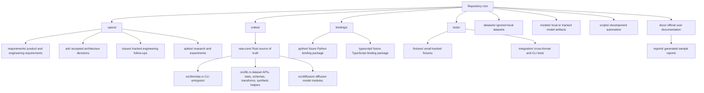
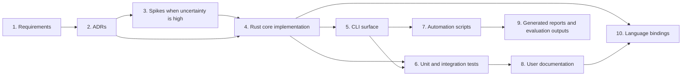
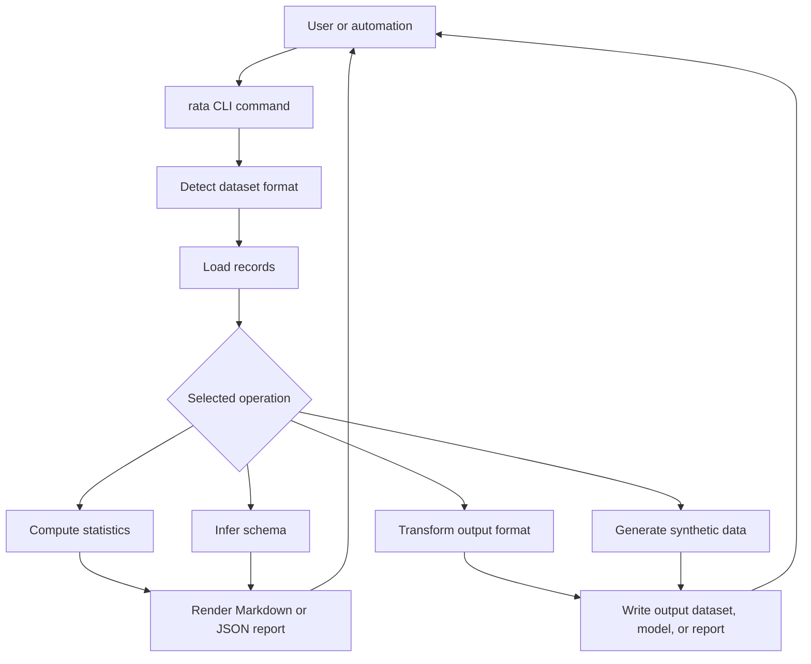

# Architecture

This document describes the repository structure, ownership order, and intended workflow for Rata.

## Repository Structure

## Project Order

The project should move from intent to implementation to validation in this order:

## Runtime Flow

## Ownership Rules

- `.specs/requirements/` defines what the project must do.
- `.specs/adr/` defines durable architectural decisions.
- `.specs/issues/` tracks review findings and planned improvements.
- `crates/rata-core/` is the canonical implementation boundary.
- `docs/` is the official user-facing documentation surface.
- `datasets/` is for ignored local data; small deterministic test assets belong in `tests/fixtures/`.
- `bindings/` should stay thin and reuse the Rust core rather than duplicating behavior.

## Current Architectural Notes

- The Rust core is currently the only implemented runtime surface.
- Python and TypeScript bindings are planned by ADR but not implemented yet.
- The current stats path is eager and full-dataset oriented; future large-dataset work should introduce bounded preview readers and streaming or sampled statistics.
- The diffusion module already uses a clearer module split than the rest of the core and is a useful direction for future refactors.
